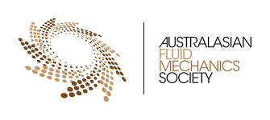

You are invited to join ACPAAF2026 (9-11 February 2026, Sydney), a forum to share the latest developments and practical applications of particle-based approaches in various fields of science and engineering. Particle-based methods are becoming increasingly popular for studying fluid dynamics, showing a great promise in accurately simulating and measuring fluid flow in a wide range of applications, from microfluidics to macroscopic systems. 

### Topics

- Numerical methods (such as LBM, SPH, and DEM etc.)
- Experimental approaches for studying fluid flow / fluid-particle systems
- Applications using particle-based methods

### Invited Speakers

- Prof Timm Krüger, University of Edinburgh
- Prof Emilie Sauret, Queensland University of Technology (QUT)
- Prof Ha H. Bui, Monash University
- A/Prof Jing Lu, Tsinghua University, Shenzhen
- Dr Morgen Li, The University of Sydney
- Dr Zhongzheng Wang, QUT

### When and Where
9-11 February 2026
The University of Sydney, NSW 2006, Australia

### Abstract Submission:
Please submit your one-page abstract or any enquiries to [abstract@acpaaf.org](mailtp:abstract@acpaaf.org) 

Updates will be available on our conference website: [acpaaf.org](https://acpaaf.org)

### Registration
| Type | Early Birds (Before 31/12/2) | Standard Rate (After 1/1/26) |
| Non-AFMS member | A$350 | A$450 |
| AFMS member | A$250 |  A$350 |
| Student |  A$150 | A$250 |

Online payment can be made [here](https://pay.sydney.edu.au/ACPAAF-2026).

### Accommondation

### Conference Program

### Local Organising Committee
- A/Prof Yixiang Gan
- Dr Michael Heisel
- Dr Morgan Li
- Prof Chengwang Lei

|  | |

Sponsored by the Australian Fluid Mechanics Society [AFMS](https://www.afms.org.au/).